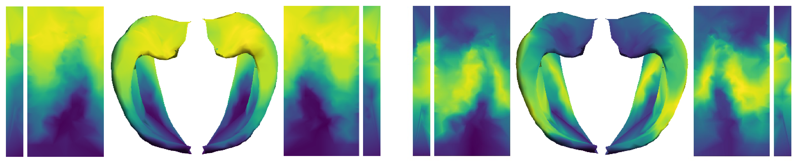

# Hippocampus_cortex_gradient_youth

Code and data for the manuscript entitled "Hippocampus reorganizes its function and geometry along a dual long-axis for cognitive maturation in youth" by Zeng et al.

## File descriptions

The code files are located within the `Code/` directory,

1. `compute_gradient_avg_all.m`: This script computes group-averaged hippocampal-cortical connectome gradients, visualizes these gradients on mid-thickness surfaces, and tests the relationships between hippocampal gradients and AP/PD coordinates.  
2. `hippgrad_ctx_projection.m`: In this script, the cortical projection of hippocampal gradients is computed. It also visualizes the group-averaged projection map and tests the relationships between cortical projection maps and cortical functional hierarchy (FH).  
3. `hippvol_eigenmode_calculation.sh`: This script computes the Laplacian eigenmodes for each individual hippocampus.  
4. `compute_gradient_geometry_coupling.m` This script computes the coupling between individual hippocampal gradients and their geometric eigenmodes. It visualizes the group-averaged geometric eigenmodes and tests the relationships between group-averaged geometric eigenmodes and group-level functional gradients.  
5. `G_feat_age_gam.R`: This script fits the developmental trajectories of explained variance and distribution characteristics corresponding to hippocampal gradients.  
6. `Mye_bins_age_gam_HCD.R`: This script fits the developmental trajectories of mean T1w/T2w intensity within each of the uniform partitioned bins along the group-averaged myelin content axis.  
7. `G_bins_age_gam_HCD.R`: This script fits the developmental trajectories of mean gradient values within each of the uniform  partitioned bins along the group-averaged myelin content axis.  
8. `G_CTX_FH_age_gam.R`: This script investigates the developmental pattern of the association  between individual gradient projections and the adult cortical FH map.  
9. `G_CTX_proj_LR_age_gam.R`: This script characterizes the maturational changes in hippocampal gradient projections in individual cortical regions. Please note that running this analysis may take approximately 6 minutes.  
10. `EigMod_G_age_gam.R`: This script models the age-related trajectory of the coupling between hippocampal geometric modes and their corresponding gradients.  
11. `Brain_behavior_association.m`: This script tests the relationship between Executive Function performance and the geometric-functional coupling of lLG.  
12. `Brain_behavior_association_agegrp.m`: This script tests the relationship between Executive Function performance and the geometric-functional coupling of qLG within specific age groups.  

Additionally, intermediate processing results produced by the above scripts are included in `Results/`. These include group-averaged hippocampal-cortical connectivity and corresponding gradients, group-averaged cortical projections of hippocampal gradients, and group-averaged hippocampal geometric eigenmodes.

## Installation
Download the repository, and you will find all the MATLAB dependencies in  `Dependencies/Matlab/`. All MATLAB codes are ready to use. The R packages can be installed using the `install.packages()` method.

For the Python codes, set up the environment based on the `*_package_list.txt` in `Dependencies/Python/`. 

## Downloading data

We provide example data for one subject in the `Data/` directory, which includes hippocampal fMRI and cortical fMRI data, output files from `Hippunfold`, and files related to hippocampal geometric eigenmodes. You can download this data from _.

You can download the transcription data from the [Allen Human Brain Atlas](http://human.brain-map.org/static/download) site and get the renormalized sample coordinates in MNI space at [here](ttps://zenodo.org/records/2483290).   

## Original data

The original and preprocessed HCP-D data, after meeting eligibility requirements, can be accessed [here](https://humanconnectome.org/study/hcp-lifespan-development).

## Dependencies

Some of the dependency packages, especially those with modifications, have been stored in the `Dependencies/` folder to ensure version compatibility. 

1. **Hippocampal gradient computation and visualization:**

- [cifti-matlab](https://github.com/Washington-University/cifti-matlab)(v2.1.0)
	
- [gifti](https://github.com/gllmflndn/gifti)
	
- [BrainSpace tool](https://github.com/MICA-MNI/BrainSpace)(v0.1.10) with modifications in `plotter.m` used by `plot_hemispheres.m` for enhanced brain visualization 
	
- [gramm](https://github.com/piermorel/gramm)
	
- [SurfStat](https://math.mcgill.ca/keith/surfstat/) with modifications to include additional useful functions

2. **Hippocampal geometric eigenmodes computation:** 

- Partially adapted from [BrainEigenmodes](https://github.com/NSBLab/BrainEigenmodes/tree/main) by Pang et al.
	
- Dependencies: [FSL](https://fsl.fmrib.ox.ac.uk/fsl/fslwiki/FslInstallation), [FreeSurfer](https://surfer.nmr.mgh.harvard.edu/fswiki/DownloadAndInstall), [Connectome Workbench](https://www.humanconnectome.org/software/get-connectome-workbench), and [Gmsh](https://gmsh.info/) software
	
- Python environment details in `Dependencies/Python/BrainEigMod_package_list.txt`.

3. **Transcriptomic association and gene enrichment analysis of hippocampal gradients:** 

- Partially adapted from [Hippocampus_AP_Axis](https://github.com/illdopejake/Hippocampus_AP_Axis) by Vogel et al. 
	
- Python environment details in `Dependencies/Python/Hipp_Gene_package_list.txt`.
	
- [Metascape web tool](https://metascape.org/) 
	
- [Developmental-specific expression analysis (SEA) tool](http://doughertylab.wustl.edu/csea-tool-2/)

4. **Analysis of developmental effects:**
	
- R packages: [mgcv](https://rdocumentation.org/packages/mgcv/versions/1.8-42)(v1.8-42) and [gratia](https://rdocumentation.org/packages/gratia/versions/0.8.1)(v0.8.1)

## Compatibility

The code has been tested on Python 3.8, MATLAB R2018a, and R 4.2.3.

## Citation

If you use our code in your research, please cite us as follows:

[PREPRINT] D. Zeng, Q. Li, D. Li, ..., Y. He, X. Zuo, S. Li, Dual long-axis reorganization of hippocampus in youth, bioRxiv (2023) (DOI: [10.1101/2023.11.03.565423](https://www.biorxiv.org/content/10.1101/2023.11.03.565423v1))

## Further details

Please contact debin_z@126.com if you need any further details.
